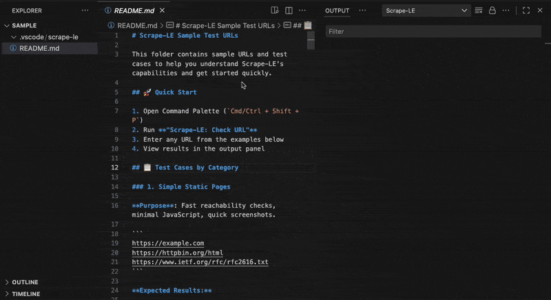
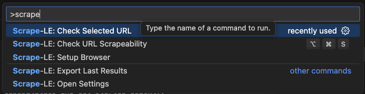

<p align="center">
  
</p>
<h1 align="center">Scrape-LE: Zero Hassle Web Scrapeability Checker</h1>
<p align="center">
  <b>Verify page reachability, capture screenshots, and detect anti-scraping measures before deploying scrapers</b><br/>
  <i>Real Browser • Screenshots • Console Errors • Anti-Bot Detection</i>
</p>

<p align="center">
  <!-- VS Code Marketplace -->
  <a href="https://marketplace.visualstudio.com/items?itemName=nolindnaidoo.scrape-le">
    
  </a>
  <!-- Build -->
  <a href="https://github.com/nolindnaidoo/scrape-le/actions">
    
  </a>
  <!-- License -->
  <a href="https://github.com/nolindnaidoo/scrape-le/blob/main/LICENSE">
    
  </a>
</p>

<p align="center">
  <i>Tested on <b>Ubuntu</b>, <b>macOS</b>, and <b>Windows</b> for maximum compatibility.</i>
</p>

---

<p align="center">
  
  
</p>

<p align="center">
  <i>💡 First time? Run <b>"Scrape-LE: Setup Browser"</b> from Command Palette to install Chromium (~130MB one-time setup)</i>
</p>

## 🙏 Thank You

If Scrape-LE saves you time, a quick rating helps other developers discover it:  
⭐ [VS Code Marketplace](https://marketplace.visualstudio.com/items?itemName=nolindnaidoo.scrape-le) • [Open VSX](https://open-vsx.org/extension/nolindnaidoo/scrape-le)

## ✅ Why Scrape-LE?

Validate scraper targets **before debugging your code**. Check if sites are reachable, detect auth walls, and verify selectors — all from your editor.

Scrape-LE uses real browser automation (Playwright) to catch issues early: JavaScript rendering errors, authentication requirements, CAPTCHA detection, and selector validation. Stop wasting time debugging code when the problem is the target site.

- **Pre-deployment validation**  
  Test target URLs before writing scraper code. Catch unreachable sites, JS errors, and rendering issues early.

- **Visual confirmation**  
  Full-page screenshots provide instant visual proof that pages render correctly.

- **Advanced detection suite**  
  Identify anti-bot systems (Cloudflare, reCAPTCHA, hCaptcha), rate limits, robots.txt policies, and authentication walls before they break your scrapers.

- **Console error detection**  
  Identify JavaScript errors that might break scrapers dependent on dynamic content.

- **Fast feedback loop**  
  Get results in seconds, not minutes. Status bar integration shows check progress without blocking your workflow.

- **One-click setup**  
  Automatic Chromium installation means you're ready to check URLs in minutes, not hours.

## 🚀 More from the LE Family

- **[String-LE](https://marketplace.visualstudio.com/items?itemName=nolindnaidoo.string-le)** - Extract user-visible strings for i18n and validation • [Open VSX](https://open-vsx.org/extension/nolindnaidoo/string-le)
- **[Numbers-LE](https://marketplace.visualstudio.com/items?itemName=nolindnaidoo.numbers-le)** - Extract and analyze numeric data with statistics • [Open VSX](https://open-vsx.org/extension/nolindnaidoo/numbers-le)
- **[EnvSync-LE](https://marketplace.visualstudio.com/items?itemName=nolindnaidoo.envsync-le)** - Keep .env files in sync with visual diffs • [Open VSX](https://open-vsx.org/extension/nolindnaidoo/envsync-le)
- **[Paths-LE](https://marketplace.visualstudio.com/items?itemName=nolindnaidoo.paths-le)** - Extract file paths from imports and dependencies • [Open VSX](https://open-vsx.org/extension/nolindnaidoo/paths-le)
- **[URLs-LE](https://marketplace.visualstudio.com/items?itemName=nolindnaidoo.urls-le)** - Audit API endpoints and external resources • [Open VSX](https://open-vsx.org/extension/nolindnaidoo/urls-le)
- **[Colors-LE](https://marketplace.visualstudio.com/items?itemName=nolindnaidoo.colors-le)** - Extract and analyze colors from stylesheets • [Open VSX](https://open-vsx.org/extension/nolindnaidoo/colors-le)
- **[Dates-LE](https://marketplace.visualstudio.com/items?itemName=nolindnaidoo.dates-le)** - Extract temporal data from logs and APIs • [Open VSX](https://open-vsx.org/extension/nolindnaidoo/dates-le)

## 💡 Use Cases

- **Pre-Scraper Validation** - Check if sites are reachable before writing scraper code
- **Anti-Bot Detection** - Identify Cloudflare, reCAPTCHA, hCaptcha before deployment
- **Rate Limit Discovery** - Find rate limits before hitting them in production
- **robots.txt Compliance** - Verify crawling is allowed by site policies
- **Auth Wall Detection** - Check if login or paywalls block access
  Disallow: /admin/, /api/internal/
  Crawl-delay: 10 seconds
  Sitemap: https://example.com/sitemap.xml

````

## 🚀 Quick Start

1. **Install from VS Code Marketplace**
   - VS Code Marketplace: [Install here](https://marketplace.visualstudio.com/items?itemName=nolindnaidoo.scrape-le)
2. Open Command Palette (`Cmd/Ctrl + Shift + P`).
3. Run **"Scrape-LE: Check URL"** or press `Cmd+Alt+S` / `Ctrl+Alt+S`.
4. Enter URL and view detailed results.

**Need test URLs?** Check out [`sample/README.md`](sample/README.md) for 10 categorized test cases including static sites, SPAs, APIs, protected sites, and more.

### First-Time Setup

On first use, Scrape-LE automatically detects if Chromium is installed and prompts you to install it. This is a one-time setup (~130MB download).

**Automatic Installation:**

1. Run any check command
2. Click "Install Chromium" when prompted
3. Wait for installation to complete

**Manual Setup:**

```bash
bunx playwright install chromium
````

Or run from Command Palette: **"Scrape-LE: Setup Browser"**

## ⚙️ Configuration

### Basic Settings

- `scrape-le.browser.timeout` – Navigation timeout (5s - 120s)
- `scrape-le.browser.viewport.width` – Viewport width (320px - 3840px)
- `scrape-le.browser.viewport.height` – Viewport height (240px - 2160px)
- `scrape-le.screenshot.enabled` – Enable screenshot capture
- `scrape-le.screenshot.path` – Screenshot save location
- `scrape-le.checkConsoleErrors` – Capture console errors
- `scrape-le.notificationsLevel` – Control notification verbosity
- `scrape-le.statusBar.enabled` – Show status bar entry

### Detection Features

- `scrape-le.detections.antiBot` – Detect anti-bot systems (Cloudflare, reCAPTCHA, hCaptcha, DataDome, Perimeter81)
- `scrape-le.detections.rateLimit` – Detect rate limiting headers
- `scrape-le.detections.robotsTxt` – Check robots.txt policies
- `scrape-le.detections.authentication` – Detect authentication walls

### Real-World Configuration Examples

**Production Scraper Validation**

```json
{
  "scrape-le.browser.timeout": 30000,
  "scrape-le.screenshot.enabled": true,
  "scrape-le.detections.antiBot": true,
  "scrape-le.detections.rateLimit": true,
  "scrape-le.detections.robotsTxt": true,
  "scrape-le.notificationsLevel": "important"
}
```

**Quick Reachability Check**

```json
{
  "scrape-le.browser.timeout": 10000,
  "scrape-le.screenshot.enabled": false,
  "scrape-le.detections.antiBot": false,
  "scrape-le.detections.rateLimit": false,
  "scrape-le.detections.robotsTxt": false,
  "scrape-le.notificationsLevel": "silent"
}
```

**Development Mode**

```json
{
  "scrape-le.browser.timeout": 60000,
  "scrape-le.screenshot.enabled": true,
  "scrape-le.checkConsoleErrors": true,
  "scrape-le.detections.antiBot": true,
  "scrape-le.detections.authentication": true,
  "scrape-le.notificationsLevel": "all"
}
```

### ⚠️ Behaviors & Limits

- Browser launch requires ~130MB Chromium installation (one-time)
- Timeout ranges from 5s to 120s; adjust based on target site complexity
- Screenshots saved to `.vscode/scrape-le/` by default
- Large pages may take longer to capture full screenshots
- Anti-bot detection uses heuristics; some systems may not be detected
- robots.txt fetch has 5-second timeout
- Authentication detection checks HTTP status, forms, and keywords

See [`docs/CONFIGURATION.md`](docs/CONFIGURATION.md).

## ⚡ Performance

Scrape-LE performance varies by target website and network. See [detailed benchmarks](docs/PERFORMANCE.md).

| Scenario           | Page Size     | Duration | Memory    | Status |
| ------------------ | ------------- | -------- | --------- | ------ |
| **Simple HTML**    | < 100 KB      | < 2s     | < 20 MB   | ✅     |
| **Complex**        | 500 KB - 1 MB | 3-5s     | 30-50 MB  | ✅     |
| **Heavy JS (SPA)** | 1-3 MB        | 5-10s    | 50-100 MB | ⚠️     |
| **Image-heavy**    | 2-5 MB        | 5-15s    | 60-120 MB | ⚠️     |

**Browser**: Launch 1-2s, screenshot 200-800ms PNG / 150-600ms JPEG  
**Detection**: Anti-bot 85-90% accuracy (< 100ms), Rate limits 80-85% (< 50ms)  
**Full Metrics**: [docs/PERFORMANCE.md](docs/PERFORMANCE.md) • Network-dependent performance

- **Timeout Configuration**: Adjust based on target site complexity
- **Screenshot Impact**: Adds 1-2s to overall check time
- **Detection Suite**: Adds 500ms-2s for all checks combined

## 🧩 System Requirements

**VS Code** 1.70.0+ • **Platform** Windows, macOS, Linux  
**Memory** 1GB recommended • **Storage** 150MB (includes Chromium)

## 🔒 Privacy

100% local processing. URLs only sent to sites you specify. No analytics or tracking.

## 🌍 Language Support

**13 languages**: English, German, Spanish, French, Indonesian, Italian, Japanese, Korean, Portuguese (Brazil), Russian, Ukrainian, Vietnamese, Chinese (Simplified)

## 🔧 Troubleshooting

**"Executable doesn't exist" error?**  
Run **"Scrape-LE: Setup Browser"** from Command Palette to install Chromium

**Check times out?**  
Increase timeout: `scrape-le.browser.timeout` (default 30s) or check network connection

**Need help?**  
Check [Issues](https://github.com/nolindnaidoo/scrape-le/issues) or enable verbose logging: `scrape-le.notificationsLevel: "all"`

## ❓ FAQ

**Need to install Chromium?**  
No, Scrape-LE handles it automatically on first use (~130MB download)

**Works with localhost?**  
Yes, supports localhost, local IPs, and any accessible URL

**Works with React/Vue/Angular?**  
Yes, uses real browser so SPAs render properly

**Will sites detect this?**  
Uses headless Chromium which some sites detect. Use responsibly and check robots.txt

## 📊 Testing

**96 unit tests** • **87% function coverage, 91% line coverage**  
Powered by Vitest • Run with `bun test --coverage`

---

Copyright © 2025  
<a href="https://github.com/nolindnaidoo">@nolindnaidoo</a>. All rights reserved.
