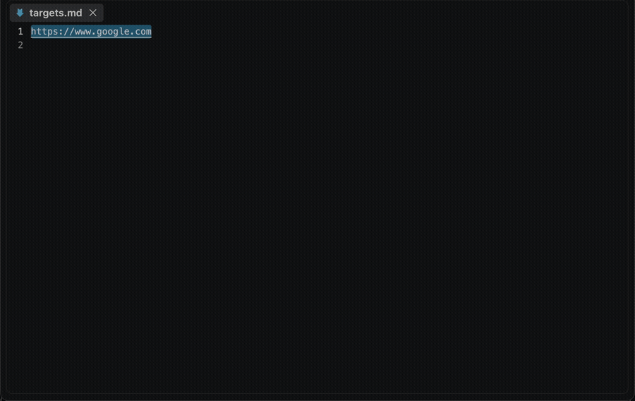

<p align="center">
  
</p>
<h1 align="center">Scrape-LE: Zero Hassle Scrapeability Checks</h1>
<p align="center">
  <b>Load a URL in headless Chromium and see what will block your scraper — before you write it</b><br/>
  <i>Anti-bot vendors, rate limits, robots.txt rules, login walls, console errors, screenshots</i>
</p>

<p align="center">
  <a href="https://marketplace.visualstudio.com/items?itemName=nolindnaidoo.scrape-le">
    
  </a>
  <a href="https://letools.dev">
    
  </a>
</p>

---

<p align="center">
  
</p>

> **Useful?** A star or rating is how other developers find it —
> [★ GitHub](https://github.com/nolindnaidoo/scrape-le) ·
> [★ Marketplace](https://marketplace.visualstudio.com/items?itemName=nolindnaidoo.scrape-le&ssr=false#review-details) ·
> [★ Open VSX](https://open-vsx.org/extension/OffensiveEdge/scrape-le/reviews)

## What it does

Run `Scrape-LE: Check URL Scrapeability` (`Ctrl+Alt+S` / `Cmd+Alt+S`), enter a URL, and the page loads in a real headless Chromium. The report lands in the output channel: HTTP status, page title, load time, console errors, a full-page screenshot, and four detections. Works in VS Code and VS Code–based editors like Cursor and VSCodium (installable from Open VSX).

One-time setup: run `Scrape-LE: Setup Browser` to install Chromium (~130MB, into Playwright's browser cache).

## Detections

| Detection | How it works |
|---|---|
| Anti-bot vendors | Response headers, script sources, DOM elements, and window globals fingerprint Cloudflare (incl. Turnstile challenges), reCAPTCHA, hCaptcha, DataDome, and PerimeterX |
| Rate limiting | `X-RateLimit-*` / `RateLimit-*` / `Retry-After` response headers, plus HTTP 429 |
| robots.txt | Fetches `<origin>/robots.txt` and evaluates the `User-agent: *` rules against your URL with RFC 9309 semantics — grouped agents, `Allow`/`Disallow` longest-match, `*` wildcards, `$` anchors, crawl-delay, sitemaps |
| Authentication | HTTP 401/403, login forms (password + username fields), auth keywords in page text, auth path segments in the final URL |

Honest limitations: signatures are best-effort fingerprints of public integration patterns — a detected widget means the page *can* challenge you, not that it will, and a clean result is not proof a site allows scraping. Agent-specific robots.txt groups are ignored (only the `*` rules are reported). Pages get up to 5 seconds to go network-idle after load, so content rendered later than that can be missed by the page-level detections.

## Commands

| Command | Description |
|---|---|
| `Scrape-LE: Check URL Scrapeability` (`Ctrl+Alt+S` / `Cmd+Alt+S`) | Prompt for a URL and run the full check |
| `Scrape-LE: Check Selected URL` | Run the check on the URL in the current selection (also in the right-click menu) |
| `Scrape-LE: Setup Browser` | Install or verify the Chromium browser |
| `Scrape-LE: Open Settings` | Open Scrape-LE settings |
| `Scrape-LE: Help & Troubleshooting` | Built-in documentation |

## Settings

| Setting | Default | Description |
|---|---|---|
| `scrape-le.browser.timeout` | `30000` | Page-load timeout in ms (5000–120000) |
| `scrape-le.browser.viewport.width` | `1280` | Viewport width |
| `scrape-le.browser.viewport.height` | `720` | Viewport height |
| `scrape-le.browser.userAgent` | `""` | Custom User-Agent (empty = Chromium default) |
| `scrape-le.screenshot.enabled` | `true` | Save a full-page screenshot per check |
| `scrape-le.screenshot.path` | `.vscode/scrape-le` | Screenshot directory (workspace-relative or absolute) |
| `scrape-le.screenshot.format` | `png` | `png` or `jpeg` |
| `scrape-le.screenshot.quality` | `90` | JPEG quality 0–100 (ignored for png) |
| `scrape-le.checkConsoleErrors` | `true` | Capture console and page errors while loading |
| `scrape-le.detections.antiBot` | `true` | Anti-bot vendor detection |
| `scrape-le.detections.rateLimit` | `true` | Rate-limit detection |
| `scrape-le.detections.robotsTxt` | `true` | robots.txt fetch + evaluation |
| `scrape-le.detections.authentication` | `true` | Authentication-wall detection |
| `scrape-le.notificationsLevel` | `important` | `all` = every notification, `important` = warnings + errors, `silent` = errors only |
| `scrape-le.statusBar.enabled` | `true` | Show the status bar item |

The settings UI is translated into 12 languages besides English.

## Privacy & security

- **Network access is the feature, and it is scoped.** A check talks to exactly two things: the URL you enter (loaded in headless Chromium, which fetches that page's own resources like any browser) and that origin's `/robots.txt`. Nothing is sent anywhere else — no telemetry, no analytics.
- **Screenshots stay local**, written to the configured path inside your workspace.
- Error notifications redact home directories and credential-shaped fragments.
- Respect the sites you check: a scrapeability report is information, not permission.

## Development

```bash
bun install
bun run build            # esbuild bundle -> dist/extension.js
bun run typecheck        # tsc --noEmit (includes tests)
bun run test             # vitest unit suite
bun run test:integration # real VS Code extension host
bun run lint             # biome
bun run package          # VSIX into release/
```

Architecture and conventions live in [AGENTS.md](AGENTS.md). Changes are tracked in [CHANGELOG.md](CHANGELOG.md).

## Performance

<!-- performance:start -->
| Input | Size | Found | Time | Rate | Scan speed |
| --- | --- | --- | --- | --- | --- |
| Header signature scan | 2.83 MB | 20,000 | 5.19 ms | 3,852,946/sec | 544.6 MB/s |
| robots.txt path match | 3.32 MB | 60,000 | 9.64 ms | 6,223,689/sec | 344.3 MB/s |

Median of 7 runs after warmup, on Apple M5 Pro, 24 GB RAM, Node 24.3.0. Inputs are generated
by `scripts/benchmark.ts` rather than checked in, so the sizes above are
exactly what was measured. Reproduce with `bun run benchmark`.

These are machine-specific and are not asserted in CI — a benchmark that gates
a build only tells you how busy the runner was.
<!-- performance:end -->

## Testing

<!-- coverage:start -->
| Metric | Coverage |
| --- | --- |
| Statements | 88.56% |
| Branches | 80.05% |
| Functions | 83.65% |
| Lines | 88.63% |

242 test cases across 24 files, plus an integration suite that runs
in a real VS Code extension host and an end-to-end test that installs the
built `.vsix` into a clean profile.

Generated from `coverage/coverage-summary.json` by
`scripts/coverage-readme.js`; CI fails if this section drifts from a fresh
run. Reproduce with `bun run test:coverage`.
<!-- coverage:end -->

## More from the LE Family

Every tool in the family, one page: **[letools.dev](https://letools.dev)**

- **[Paths-LE](https://marketplace.visualstudio.com/items?itemName=nolindnaidoo.paths-le)** - Extract file paths from JS/TS imports, JSON, HTML, CSS, TOML, CSV, and .env
- **[String-LE](https://marketplace.visualstudio.com/items?itemName=nolindnaidoo.string-le)** - Extract string values for i18n from JSON, YAML, CSV, TOML, INI, and .env
- **[Numbers-LE](https://marketplace.visualstudio.com/items?itemName=nolindnaidoo.numbers-le)** - Extract numeric values from JSON, YAML, CSV, TOML, INI, and .env
- **[EnvSync-LE](https://marketplace.visualstudio.com/items?itemName=nolindnaidoo.envsync-le)** - Spot missing keys across your .env files, with a markdown report
- **[Regex-LE](https://marketplace.visualstudio.com/items?itemName=nolindnaidoo.regex-le)** - Find, test, and validate regular expressions with ReDoS screening
- **[Secrets-LE](https://marketplace.visualstudio.com/items?itemName=nolindnaidoo.secrets-le)** - Detect and sanitize credentials locally, before you commit
- **[Colors-LE](https://marketplace.visualstudio.com/items?itemName=nolindnaidoo.colors-le)** - Extract and analyze colors from CSS, SCSS, LESS, Stylus, HTML, JS/TS, and SVG
- **[URLs-LE](https://marketplace.visualstudio.com/items?itemName=nolindnaidoo.urls-le)** - Extract URLs from documentation, configs, and code
- **[Dates-LE](https://marketplace.visualstudio.com/items?itemName=nolindnaidoo.dates-le)** - Extract and analyze dates from logs, configs, and code

## Also by nolindnaidoo

**Rust**

- **[pixelcoords](https://github.com/nolindnaidoo/pixelcoords)** - Mark pixel-exact coordinates machines can use · [pixelcoords.dev](https://pixelcoords.dev)
- **[pixelactions](https://github.com/nolindnaidoo/pixelactions)** - Perform the interaction and confirm it landed · [pixelactions.dev](https://pixelactions.dev)

**Contact Developer** — [GitHub](https://github.com/nolindnaidoo) · [LinkedIn](https://www.linkedin.com/in/nolindnaidoo/)

## License

MIT © [nolindnaidoo](https://github.com/nolindnaidoo)
