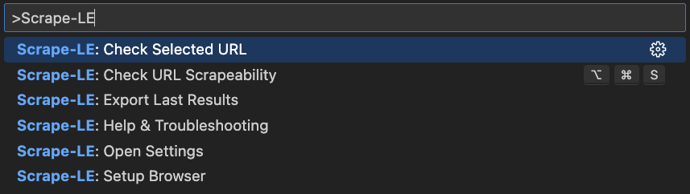

<p align="center">
  
</p>
<h1 align="center">Scrape-LE: Zero Hassle Web Scrapeability Checker</h1>
<p align="center">
  <b>Verify page reachability, capture screenshots, and detect anti-scraping measures before deploying scrapers</b><br/>
  <i>Real Browser • Screenshots • Console Errors • Anti-Bot Detection</i>
</p>

<p align="center">
  <!-- VS Code Marketplace -->
  <a href="https://marketplace.visualstudio.com/items?itemName=nolindnaidoo.scrape-le">
    
  </a>
  <!-- Build -->
  <a href="https://github.com/nolindnaidoo/scrape-le/actions">
    
  </a>
  <!-- License -->
  <a href="https://github.com/nolindnaidoo/scrape-le/blob/main/LICENSE">
    
  </a>
</p>

<p align="center">
  <i>Tested on <b>Ubuntu</b>, <b>macOS</b>, and <b>Windows</b> for maximum compatibility.</i>
</p>

---

<p align="center">
  
  
</p>

<p align="center">
  <i>💡 First time? Run <b>"Scrape-LE: Setup Browser"</b> from Command Palette to install Chromium (~130MB one-time setup)</i>
</p>

## 🙏 Thank You!

Thank you for your interest in Scrape-LE! If this extension has helped verify your scraper targets or validate site accessibility, please consider leaving a rating on [VS Code Marketplace](https://marketplace.visualstudio.com/items?itemName=nolindnaidoo.scrape-le). Your feedback helps other developers discover this tool and motivates continued development.

⭐ **Star this repository** to get notified about updates and new features!

## ✅ Why Scrape-LE

**Web scraping projects fail when target sites are unreachable or behave unexpectedly.** Debugging scraper failures is time-consuming when you don't know if the issue is your code or the target site.

**Scrape-LE makes site validation effortless.**  
Quickly verify that pages load, render JavaScript correctly, and are accessible before deploying your scrapers.

- **Pre-deployment validation**  
  Test target URLs before writing scraper code. Catch unreachable sites, JS errors, and rendering issues early.

- **Visual confirmation**  
  Full-page screenshots provide instant visual proof that pages render correctly.

- **Advanced detection suite**  
  Identify anti-bot systems (Cloudflare, reCAPTCHA, hCaptcha), rate limits, robots.txt policies, and authentication walls before they break your scrapers.

- **Console error detection**  
  Identify JavaScript errors that might break scrapers dependent on dynamic content.

- **Fast feedback loop**  
  Get results in seconds, not minutes. Status bar integration shows check progress without blocking your workflow.

- **One-click setup**  
  Automatic Chromium installation means you're ready to check URLs in minutes, not hours.

## 🚀 More from the LE Family

**Scrape-LE** is part of a growing family of developer tools designed to make your workflow effortless:

- **Strings-LE** - Extract every user-visible string from JSON, YAML, CSV, TOML, INI, and .env files with zero hassle  
  [[VS Code Marketplace](https://marketplace.visualstudio.com/items?itemName=nolindnaidoo.string-le)] [[Open VSX](https://open-vsx.org/extension/nolindnaidoo/string-le)]

- **EnvSync-LE** - Effortlessly detect, compare, and synchronize .env files across your workspace with visual diffs  
  [[VS Code Marketplace](https://marketplace.visualstudio.com/items?itemName=nolindnaidoo.envsync-le)] [[Open VSX](https://open-vsx.org/extension/nolindnaidoo/envsync-le)]

- **Numbers-LE** - Extract and analyze numeric data from JSON, YAML, CSV, TOML, INI, and .env files  
  [[VS Code Marketplace](https://marketplace.visualstudio.com/items?itemName=nolindnaidoo.numbers-le)] [[Open VSX](https://open-vsx.org/extension/nolindnaidoo/numbers-le)]

- **Paths-LE** - Extract and analyze file paths from imports, configs, and dependencies  
  [[VS Code Marketplace](https://marketplace.visualstudio.com/items?itemName=nolindnaidoo.paths-le)] [[Open VSX](https://open-vsx.org/extension/nolindnaidoo/paths-le)]

- **Colors-LE** - Extract and analyze colors from CSS, HTML, JavaScript, and TypeScript  
  [[VS Code Marketplace](https://marketplace.visualstudio.com/items?itemName=nolindnaidoo.colors-le)] [[Open VSX](https://open-vsx.org/extension/nolindnaidoo/colors-le)]

- **Dates-LE** - Extract and analyze dates from logs, APIs, and temporal data  
  [[VS Code Marketplace](https://marketplace.visualstudio.com/items?itemName=nolindnaidoo.dates-le)] [[Open VSX](https://open-vsx.org/extension/nolindnaidoo/dates-le)]

- **URLs-LE** - Extract and analyze URLs from web content, APIs, and resources  
  [[VS Code Marketplace](https://marketplace.visualstudio.com/items?itemName=nolindnaidoo.urls-le)] [[Open VSX](https://open-vsx.org/extension/nolindnaidoo/urls-le)]

Each tool follows the same philosophy: **Zero Hassle, Maximum Productivity**.

## 💡 Use Cases & Examples

### Pre-Scraper Validation

Verify target accessibility before building scrapers:

```typescript
// Check reachability first
await checkUrl("https://api.example.com/data");

// Then write your scraper with confidence
async function scrapeData() {
  const response = await fetch("https://api.example.com/data");
  // ... scraper logic
}
```

### Anti-Bot Detection

Identify protection systems before deployment:

```typescript
// Detect anti-bot measures
✅ Cloudflare Protection: Not detected
✅ reCAPTCHA: Not detected
⚠️  hCaptcha: Detected (may require captcha solving)
✅ DataDome: Not detected
```

### Rate Limit Discovery

Find rate limits before hitting them:

```typescript
// Discover rate limits
Rate Limit: 100 requests per minute
Remaining: 95 requests
Reset: 45 seconds
```

### robots.txt Compliance

Verify crawling is allowed:

```typescript
// Check robots.txt
Disallow: /admin/, /api/internal/
Crawl-delay: 10 seconds
Sitemap: https://example.com/sitemap.xml
```

## 🚀 Quick Start

1. **Install from VS Code Marketplace**
   - VS Code Marketplace: [Install here](https://marketplace.visualstudio.com/items?itemName=nolindnaidoo.scrape-le)
2. Open Command Palette (`Cmd/Ctrl + Shift + P`).
3. Run **"Scrape-LE: Check URL"** or press `Cmd+Alt+S` / `Ctrl+Alt+S`.
4. Enter URL and view detailed results.

**Need test URLs?** Check out [`sample/README.md`](sample/README.md) for 10 categorized test cases including static sites, SPAs, APIs, protected sites, and more.

### First-Time Setup

On first use, Scrape-LE automatically detects if Chromium is installed and prompts you to install it. This is a one-time setup (~130MB download).

**Automatic Installation:**

1. Run any check command
2. Click "Install Chromium" when prompted
3. Wait for installation to complete

**Manual Setup:**

```bash
bunx playwright install chromium
```

Or run from Command Palette: **"Scrape-LE: Setup Browser"**

## ⚙️ Configuration

### Basic Settings

- `scrape-le.browser.timeout` – Navigation timeout (5s - 120s)
- `scrape-le.browser.viewport.width` – Viewport width (320px - 3840px)
- `scrape-le.browser.viewport.height` – Viewport height (240px - 2160px)
- `scrape-le.screenshot.enabled` – Enable screenshot capture
- `scrape-le.screenshot.path` – Screenshot save location
- `scrape-le.checkConsoleErrors` – Capture console errors
- `scrape-le.notificationsLevel` – Control notification verbosity
- `scrape-le.statusBar.enabled` – Show status bar entry

### Detection Features

- `scrape-le.detections.antiBot` – Detect anti-bot systems (Cloudflare, reCAPTCHA, hCaptcha, DataDome, Perimeter81)
- `scrape-le.detections.rateLimit` – Detect rate limiting headers
- `scrape-le.detections.robotsTxt` – Check robots.txt policies
- `scrape-le.detections.authentication` – Detect authentication walls

### Real-World Configuration Examples

**Production Scraper Validation**

```json
{
  "scrape-le.browser.timeout": 30000,
  "scrape-le.screenshot.enabled": true,
  "scrape-le.detections.antiBot": true,
  "scrape-le.detections.rateLimit": true,
  "scrape-le.detections.robotsTxt": true,
  "scrape-le.notificationsLevel": "important"
}
```

**Quick Reachability Check**

```json
{
  "scrape-le.browser.timeout": 10000,
  "scrape-le.screenshot.enabled": false,
  "scrape-le.detections.antiBot": false,
  "scrape-le.detections.rateLimit": false,
  "scrape-le.detections.robotsTxt": false,
  "scrape-le.notificationsLevel": "silent"
}
```

**Development Mode**

```json
{
  "scrape-le.browser.timeout": 60000,
  "scrape-le.screenshot.enabled": true,
  "scrape-le.checkConsoleErrors": true,
  "scrape-le.detections.antiBot": true,
  "scrape-le.detections.authentication": true,
  "scrape-le.notificationsLevel": "all"
}
```

### ⚠️ Behaviors & Limits

- Browser launch requires ~130MB Chromium installation (one-time)
- Timeout ranges from 5s to 120s; adjust based on target site complexity
- Screenshots saved to `.vscode/scrape-le/` by default
- Large pages may take longer to capture full screenshots
- Anti-bot detection uses heuristics; some systems may not be detected
- robots.txt fetch has 5-second timeout
- Authentication detection checks HTTP status, forms, and keywords

See [`docs/CONFIGURATION.md`](docs/CONFIGURATION.md).

## ⚡ Performance

Scrape-LE is optimized for fast feedback:

| Operation            | Duration | Notes                         |
| -------------------- | -------- | ----------------------------- |
| **Simple Page**      | 1-3s     | Basic HTML/CSS pages          |
| **JavaScript Heavy** | 3-8s     | SPAs, React, Vue, Angular     |
| **Large Pages**      | 5-15s    | Heavy images, complex layouts |
| **Protected Sites**  | 10-30s   | Sites with anti-bot checks    |

### Performance Notes

- **Memory Usage**: ~200MB base + Chromium browser instance
- **Concurrent Checks**: One at a time to avoid resource contention
- **Network Speed**: Directly affects load times
- **Timeout Configuration**: Adjust based on target site complexity
- **Screenshot Impact**: Adds 1-2s to overall check time
- **Detection Suite**: Adds 500ms-2s for all checks combined

## 🧩 System Requirements

- **VS Code**: 1.70.0 or higher
- **Node.js**: Not required (extension uses Bun runtime)
- **Platform**: Windows, macOS, Linux
- **Memory**: 500MB minimum, 1GB recommended
- **Storage**: 150MB (25MB extension + 130MB Chromium)
- **Network**: Required for checking external URLs

## 🔒 Privacy & Telemetry

- Runs entirely locally; no data is sent off your machine.
- URLs you check are only sent to the target sites you specify.
- Optional local-only logs can be enabled with `scrape-le.notificationsLevel: "all"`.
- Logs appear in Output panel → "Scrape-LE".
- No analytics, tracking, or external API calls.

See [`docs/PRIVACY.md`](docs/PRIVACY.md).

## 🌍 Language Support

- **English** - Full support

**Note**: Scrape-LE currently supports English only. Multi-language support is planned for future releases.

Interested in helping translate Scrape-LE? We welcome contributions for additional languages! [Open an issue](https://github.com/nolindnaidoo/scrape-le/issues) to get started.

## 🔧 Troubleshooting

### Common Issues

**"Executable doesn't exist" error**

- Run **"Scrape-LE: Setup Browser"** from Command Palette
- Or manually: `bunx playwright install chromium`
- Verify installation: Run **"Scrape-LE: Setup Browser"** → "Test Browser Installation"

**Check times out**

- Increase timeout: `scrape-le.browser.timeout` (default 30s)
- Check your network connection
- Verify the URL is accessible in regular browser
- Some sites may intentionally block automated browsers

**Screenshots not saving**

- Check `scrape-le.screenshot.path` setting
- Ensure directory has write permissions
- Verify `scrape-le.screenshot.enabled: true`
- Check Output panel → "Scrape-LE" for errors

**Anti-bot detection not working**

- Enable detection: `scrape-le.detections.antiBot: true`
- Some protection systems use server-side detection only
- Detection uses heuristics and may not catch all systems
- Check Output panel for detailed detection results

**Console errors not captured**

- Enable capture: `scrape-le.checkConsoleErrors: true`
- Some errors may occur before capture starts
- Check browser console in dev tools for comparison

**Extension crashes or freezes**

- Check Chromium is properly installed
- Try reinstalling: Remove `~/Library/Caches/ms-playwright` and run setup again
- Disable other browser automation extensions
- Check Output panel → "Scrape-LE" for error messages
- Reload VS Code window

### Getting Help

- Check the [Issues](https://github.com/nolindnaidoo/scrape-le/issues) page for known problems
- Enable verbose logging: `scrape-le.notificationsLevel: "all"`
- Review logs in Output panel → "Scrape-LE"
- See [`docs/TROUBLESHOOTING.md`](docs/TROUBLESHOOTING.md) for detailed guidance

## ❓ FAQ

**Q: Do I need to install Chromium separately?**  
A: No, Scrape-LE handles installation automatically on first use. Just click "Install Chromium" when prompted.

**Q: Can I check localhost URLs?**  
A: Yes, Scrape-LE works with localhost, local network IPs, and any accessible URL.

**Q: Does this work with SPAs (React, Vue, Angular)?**  
A: Yes, Scrape-LE uses a real browser so JavaScript frameworks render properly.

**Q: Can I check multiple URLs at once?**  
A: Currently one URL at a time to ensure reliability. Batch checking is planned for future releases.

**Q: Will this trigger bot detection on target sites?**  
A: Scrape-LE uses headless Chromium which some sites detect. Use responsibly and check robots.txt first.

**Q: Can I use this in CI/CD pipelines?**  
A: Scrape-LE is designed for interactive use in VS Code. For CI/CD, consider dedicated scrapeability testing tools.

**Q: How accurate is anti-bot detection?**  
A: Detection uses common patterns and heuristics. It catches most major systems but may not detect all custom solutions.

**Q: Does this work with VPNs/proxies?**  
A: Yes, Scrape-LE respects your system's network configuration including VPNs and proxies.

## 📊 Test Coverage

- 82.17% overall coverage with istanbul provider
- 121 passing tests (1 skipped) with comprehensive edge case coverage
- Unit tests for all detector modules
- Integration tests for command workflows
- Mock Playwright browser for reliable testing
- Error handling and timeout scenarios covered

See [`docs/TESTING.md`](docs/TESTING.md).

---

Copyright © 2025  
<a href="https://github.com/nolindnaidoo">@nolindnaidoo</a>. All rights reserved.
