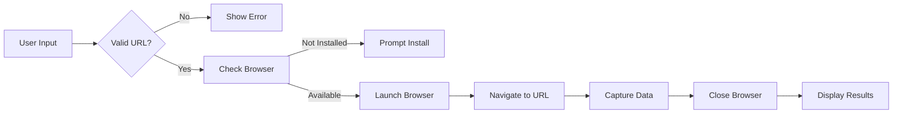

# Scrape-LE Architecture

Technical architecture, design patterns, and module boundaries for production-grade web scrapeability checking.

## Core Structure

```
src/
├── extension.ts          # Minimal activation - registers commands/providers only
├── types.ts             # Core type definitions and interfaces
├── commands/            # Command implementations with dependency injection
│   ├── index.ts         # Centralized command registration
│   ├── check.ts         # Main URL check command
│   ├── checkSelection.ts # Selected URL check command
│   └── setup.ts         # Browser setup command
├── scraper/             # Browser automation engine
│   ├── browser.ts       # Browser lifecycle management
│   ├── checker.ts       # Page scrapeability check logic
│   ├── install.ts       # Browser installation helpers
│   └── __data__/        # Test fixtures and mocks
├── config/              # Configuration management
│   ├── config.ts        # Main config reader with frozen objects
│   └── settings.ts      # VS Code settings command registration
├── ui/                  # User interface components
│   ├── statusBar.ts     # Status bar factory with state management
│   ├── notifier.ts      # Notification abstraction by level
│   └── output.ts        # Output channel for detailed logs
└── utils/               # Pure utility functions
    ├── errorHandling.ts # Error classification and formatting
    └── url.ts           # URL validation and processing
```

## Design Patterns

### Functional Programming

The extension follows functional programming principles:

- **Immutable data structures**: All exported objects use `Object.freeze()`
- **Pure functions**: Business logic separated from side effects
- **Dependency injection**: Commands receive dependencies as parameters
- **Factory functions**: UI components created via factories instead of classes

```typescript
// Example: Frozen configuration
export function getConfiguration(): Config {
  return Object.freeze({
    browser: Object.freeze({
      timeout: 30000,
      viewport: Object.freeze({ width: 1280, height: 720 }),
    }),
  })
}
```

### Command Pattern

Commands are registered centrally and follow a consistent structure:

```typescript
export function registerCheckUrlCommand(
  context: vscode.ExtensionContext,
  deps: Readonly<{
    notifier: Notifier
    statusBar: StatusBar
  }>,
): void {
  const command = vscode.commands.registerCommand('scrape-le.checkUrl', async () => {
    // Command logic
  })

  context.subscriptions.push(command)
}
```

### Factory Pattern

UI components are created via factory functions:

```typescript
export function createStatusBar(context: vscode.ExtensionContext): StatusBar {
  const statusBarItem = vscode.window.createStatusBarItem(...)

  return Object.freeze({
    show(message: string, tooltip?: string): void { ... },
    hide(): void { ... },
    dispose(): void { ... },
  })
}
```

## Runtime Flow

### URL Check Flow



### Browser Lifecycle

1. **Check Availability**: `isBrowserAvailable()` tests if Chromium is installed
2. **Launch**: `createBrowser()` starts headless Chromium with security flags
3. **Check**: `checkPageScrapeability()` navigates and collects data
4. **Cleanup**: `closeBrowser()` ensures proper resource cleanup

### Data Flow

```
User Input → URL Validation → Browser Check → Page Load →
Data Collection → Result Object → Output Channel → UI Feedback
```

## Module Boundaries

### Clear Separation of Concerns

- **commands/**: VS Code command wiring (thin layer)
- **scraper/**: Core browser automation logic (testable)
- **config/**: Configuration reading and validation
- **ui/**: User interface abstraction layer
- **utils/**: Pure utility functions (100% test coverage)

### Dependency Graph

```
extension.ts
├── commands/ (depends on: scraper/, ui/, config/, utils/)
├── scraper/ (depends on: utils/)
├── config/ (no dependencies)
├── ui/ (no dependencies)
└── utils/ (no dependencies)
```

## Key Components

### Browser Manager (`scraper/browser.ts`)

Handles Playwright browser lifecycle:

- Launches Chromium with security-focused flags
- Manages browser availability detection
- Ensures proper cleanup on errors

### Page Checker (`scraper/checker.ts`)

Performs the actual scrapeability check:

- Navigates to URL with timeout
- Captures HTTP status, title, load time
- Records console errors if enabled
- Takes full-page screenshot if enabled

### Installation Helper (`scraper/install.ts`)

Manages Chromium browser installation:

- Detects if browser is available
- Prompts user for installation
- Executes `npx playwright install chromium`
- Provides manual installation instructions

### Configuration Manager (`config/config.ts`)

Centralized configuration management:

- Reads from `vscode.workspace.getConfiguration()`
- Returns frozen configuration objects
- Validates settings and provides defaults

### URL Utilities (`utils/url.ts`)

URL processing helpers:

- Validates URL format
- Normalizes URLs (adds `https://` if missing)
- Extracts URLs from text
- Generates safe filenames from URLs

## Error Handling Strategy

### Error Classification

```typescript
export function isTimeoutError(error: unknown): boolean
export function isNetworkError(error: unknown): boolean
export function formatErrorForUser(error: unknown): string
```

### User-Friendly Messages

- Timeout errors: "⏱️ Timeout: Navigation exceeded 30s"
- Network errors: "🔌 Network error: Connection refused"
- Generic errors: "❌ Error: [details]"

### Graceful Degradation

- Screenshot failure: Continue without screenshot
- Console errors: Optional feature, doesn't block check
- Browser close error: Log but don't throw

## Testing Architecture

### Unit Tests (81% Coverage)

- **utils/**: 100% coverage (pure functions)
- **scraper/**: High coverage with Playwright mocks
- **config/**: Settings validation tests

### Test Strategy

- Mock VS Code API via `src/__mocks__/vscode.ts`
- Mock Playwright browser and page objects
- Focus on edge cases and error paths
- Integration tests for command flows

### Fixtures

- `src/scraper/__data__/mock-page.ts`: Mock Playwright page
- Test URLs with known behaviors
- Expected result objects for assertions

## Performance Considerations

### Lightweight Approach

- Uses `playwright-core` (minimal footprint)
- Headless browser (no GUI overhead)
- One browser instance per check
- Automatic cleanup prevents memory leaks

### Optimization Flags

```typescript
const browser = await chromium.launch({
  headless: true,
  args: [
    '--no-sandbox',
    '--disable-setuid-sandbox',
    '--disable-dev-shm-usage',
    '--disable-accelerated-2d-canvas',
    '--disable-gpu',
  ],
})
```

### Resource Management

- Browser closed after each check
- Screenshots saved to disk (not kept in memory)
- Console errors collected incrementally
- Progress reporting for user feedback

## Security

### Sandboxing

- Browser runs in headless mode
- Security flags enabled
- No file system access beyond screenshots
- No persistent browser state

### Input Validation

- URL validation before navigation
- Timeout enforcement
- Screenshot path sanitization
- No code execution from user input

---

**Related Documentation:**

- [Testing Guide](TESTING.md)
- [Configuration Guide](CONFIGURATION.md)
- [Development Guide](DEVELOPMENT.md)
- [Troubleshooting](TROUBLESHOOTING.md)


---
**Project:** [Issues](https://github.com/nolindnaidoo/scrape-le/issues) • [Pull Requests](https://github.com/nolindnaidoo/scrape-le/pulls) • [Releases](https://github.com/nolindnaidoo/scrape-le/releases) • [MIT License](LICENSE)

**Dev:** [Spec](SPECIFICATION.md) • [Architecture](ARCHITECTURE.md) • [Development](DEVELOPMENT.md) • [Troubleshooting](TROUBLESHOOTING.md)

**Docs:** [Commands](COMMANDS.md) • [Notifications](NOTIFICATIONS.md) • [Status Bar](STATUSBAR.md) • [Config](CONFIGURATION.md) • [Performance](PERFORMANCE.md) • [Privacy](PRIVACY.md) • [Screenshots](SCREENSHOTS.md) • [Workflow](WORKFLOW.md)
